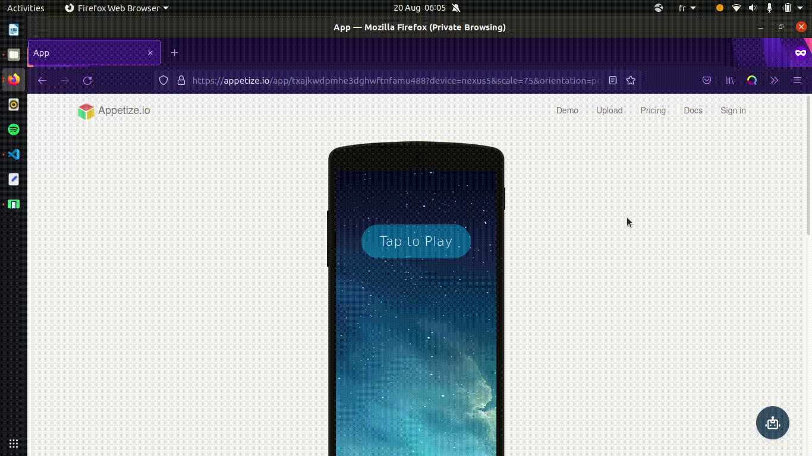
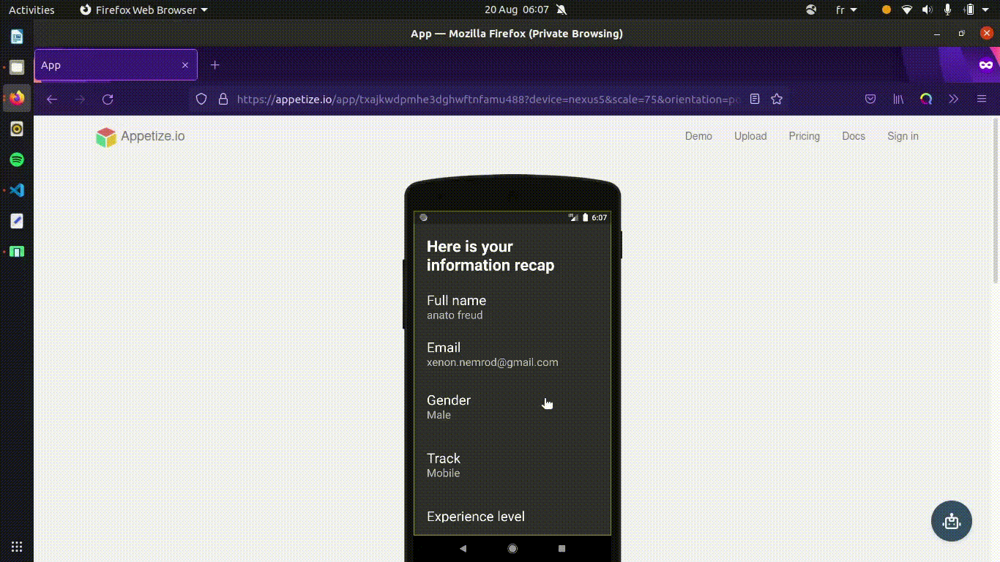

<!-- PROJECT -->
<br />
<p align="center">
  <h3 align="center">User registration mobile app (Flutter)</h3>

  <p align="center">
    Mobile task 5 | Stage 2 | HNRi8 x I4G
    <br />
    <br />
    <br />
    <a href="https://bit.ly/3j1R6Sz">View Live Preview</a>
  </p>
</p>

<!-- TABLE OF CONTENTS -->
<details open="open">
  <summary>Table of Contents</summary>
  <ol>
    <li>
      <a href="#getting-started">Mobile User Input</a>
    </li>
    <li>
      <a href="#stack-and-tools">Stack and tools</a>
    </li>
    <li>
      <a href="#installation">Installation</a>
    </li>
    <li><a href="#contact">Contact</a></li>
    <li>
      <a href="#links-to-resources">Links to resources</a>
    </li>
    <li>
      <a href="#getting-started">Getting started with Flutter</a>
    </li>

  </ol>
</details>

## Mobile User Input App

The task given is to build a simple app that collects user input and displays the input on the screen.





## Stack and tools

- Flutter v2.2.0, stable channel
- Dart v2.13.0
- VS Code v1.59.0

## Installation

1. Clone the repo

   ```sh
   git clone https://github.com/HNGi8-x-I4G/mobile_track_5.git
   ```

2. Navigate to the `mobile_track_5` folder.

3. Install the required packages

   ```sh
   flutter pub get
   ```

4. Run the app with

   ```sh
   flutter run
   ```

## Contact

Freud ANATO - [@zxenon_]

Project Link: [https://github.com/HNGi8-x-I4G/mobile_track_5.git](https://github.com/HNGi8-x-I4G/mobile_track_5.git)

Demo Link: [https://bit.ly/3j1R6Sz](https://bit.ly/3j1R6Sz)

## Links to resources

- [Zuri Internship](https://internship.zuri.team/)
- [HNG](https://hng.tech/)
- [I4G](https://ingressive.org/)

## Getting started with Flutter

A few resources to get you started if this is your first Flutter project:

- [Lab: Write your first Flutter app](https://flutter.dev/docs/get-started/codelab)
- [Cookbook: Useful Flutter samples](https://flutter.dev/docs/cookbook)

For help getting started with Flutter, view our
[online documentation](https://flutter.dev/docs), which offers tutorials,
samples, guidance on mobile development, and a full API reference.
